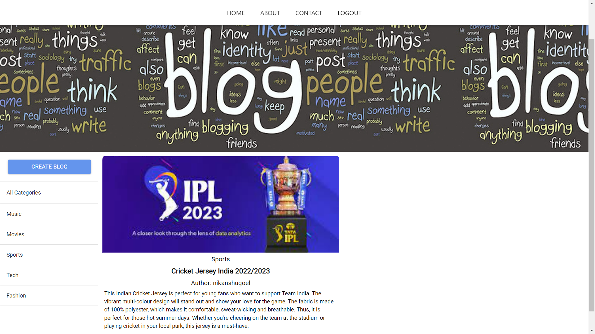
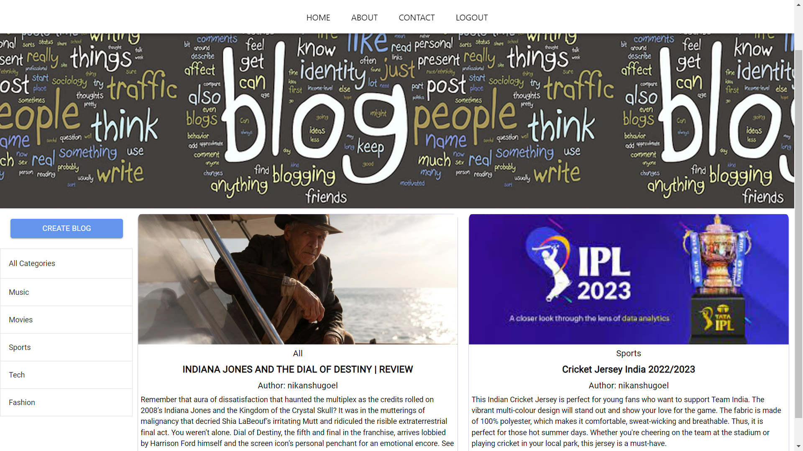

<!-- Author : Nikanshu Goyal -->

<h1> Blog Web App</h1>

- This webapp uses JWT authentication for verifying the username and password of the user.
- Made with JavaScript, HTML5 and CSS3,React,NodeJS, Express JS, MongoDB.
- Live Demo:👇

- [x] [txt-compresser.app/]()

## About this
* User-friendly interface for seamless navigation
* User authentication  for secure access
* CRUD (Create, Read, Update, Delete) operations for blog posts
* Responsive design for optimal performance on all devices.
* The website is made responsive (with HTML and CSS ) and interactive(with ReactJS) .
* An [Info page]() is added to give more information about the website.

- [x] Landing Page:

- [x] Home Page

- [x] Selected Category Page

- [x] About Page

